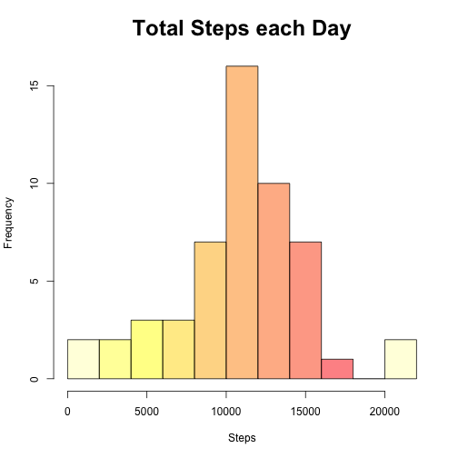
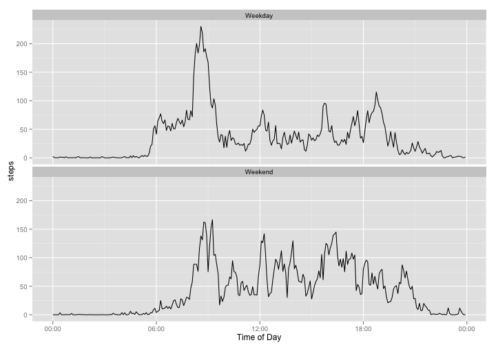

Activity Monitoring Data Analysis
=================================


## Data

The data for this assignment can be downloadd from the course web site:

* Dataset: [Activity monitoring data](https://d396qusza40orc.cloudfront.net/repdata%2Fdata%2Factivity.zip)

The variables included in this dataset are:

* **steps**: number of steps taken in a 5-minute interval (missing values coded as `NA`)
* **date**: date the measurement was taken in YYYY-MM-DD format
* **interval**: identifier for the 5-minute interval in which measurement was taken


## Load and pre-process the data:

```r
activity<-read.csv("activity.csv")
```

## What is the mean total number of steps taken per day?
* Make a histogram of the total number of steps taken each day

```r
TotalStepsPerDay <- aggregate(steps ~ date, data = activity, sum)

hist(TotalStepsPerDay[,2], main = "Total Steps each Day", breaks = 10, 
     xlab = "Steps", col=rev(heat.colors(10, .5)), cex.main = 2)
```

 

* Calculate and report the mean and median total number of of steps taken per day

```r
MeanSteps <- as.integer(mean(TotalStepsPerDay$steps, na.rm = TRUE))
MedianSteps <- median(TotalStepsPerDay$steps, na.rm = TRUE)
```
The mean total steps per day is: 10766

The median total steps per day is: 10765

## What is the average daily activity pattern?
* Make a time series plot of the 5-minute interval and the average number of steps taken, averaged across all days
* Which 5-minute interval, on average across al the days in the dataset, contains the maximum number of steps?


```r
StepsByInterval <- aggregate(steps ~ interval, data = activity, mean, na.rm = TRUE)

MaxSteps<-StepsByInterval[which.max(sbi[,2]),1]

intervals <- strptime(formatC(StepsByInterval$interval, width = 4, flag = "0"), "%H%M")

DataToPlot <- data.frame(interval = intervals, steps = StepsByInterval$steps)

plot(DataToPlot, type="l", main="Average Steps per Day by Interval", ylab="Steps", xlab="Interval", 
     lwd=2, frame.plot=FALSE, cex.main=3, cex.lab=2)
```

 
The 5-minute interval with the maximum number of steps across all the days is: 835


## Imputing missing values
* Calculate and report the total number of missing values in the dataset
* Imput missing values by replacing `NA` with mean across all days for that 5 minute interval
* Create a new dataset that is equal to the original dataset but with imputed values replacing `NA`
* Make a histogram of the total number of steps taken each day, calculate, and report the **mean** and **median** total number of steps taken per day. Do these values differ form the estimates from the first part of the assignment? What is the impact of imputing missing data on the estimates of the total daily number of steps?
* Make a time series plot


```r
MissingValues<-sum(apply(activity, 2, function(x) sum(is.na(x))))
```
The following table shows `NA` count by column of the data set. This is useful in determining a strategy for imputing across the dataset.

```
##    steps     date interval 
##     2304        0        0
```
There are 2304 missing values in the original data set


```r
library(plyr)
swapna<-function(x) replace(x, is.na(x), mean(x, na.rm = TRUE))

ImputedActivity <- ddply(activity, ~ interval, transform, steps = swapna(steps))

ImputedStepsPerDay <- aggregate(steps ~ date, data = activity, sum)

hist(ImputedStepsPerDay[,2], main = "Imputed Total Steps each Day", breaks = 10, 
     xlab = "Steps", col=rev(heat.colors(10, .5)), cex.main = 2)
```

 


```r
MeanImputedSteps<-as.integer(mean(ImputedStepsPerDay[,2], na.rm = TRUE))
MedianImputedSteps<-median(ImputedStepsPerDay[,2], na.rm = TRUE)
MeanDifference<-abs(round(MeanImputedSteps) - MeanSteps)
MedianDifference<-abs(round(MedianImputedSteps) - MedianSteps)
```

The mean imputed total number of steps taken per day: 10766

The original and imputed mean total number of steps taken per day differ by
an absolute value of : 0

The median imputed total number of steps taken per day: 10765

The original and imputed median total number of steps taken per day differ by
an absolute value of : 0

## Are there differences in activity patterns between weekdays and weekends?


```r
library(ggplot2)

ImputedActivity$weekday<-ifelse(weekdays(as.POSIXct(ImputedActivity$date, 
         format="%Y-%m-%d")) %in% c("Saturday", "Sunday"), "Weekend", "Weekday")

ImputedActivity$intervaltime<-strptime(formatC(ImputedActivity$interval, 
         width=4, flag="0"), "%H%M")

p <- qplot(intervaltime, steps, data = ImputedActivity, stat = "summary",
           fun.y = "mean", geom = "line", xlab = "Time of Day") +
           facet_wrap(~weekday, ncol = 1) + 
           scale_x_datetime(labels = date_format("%H:%M")) 

p
```

 
